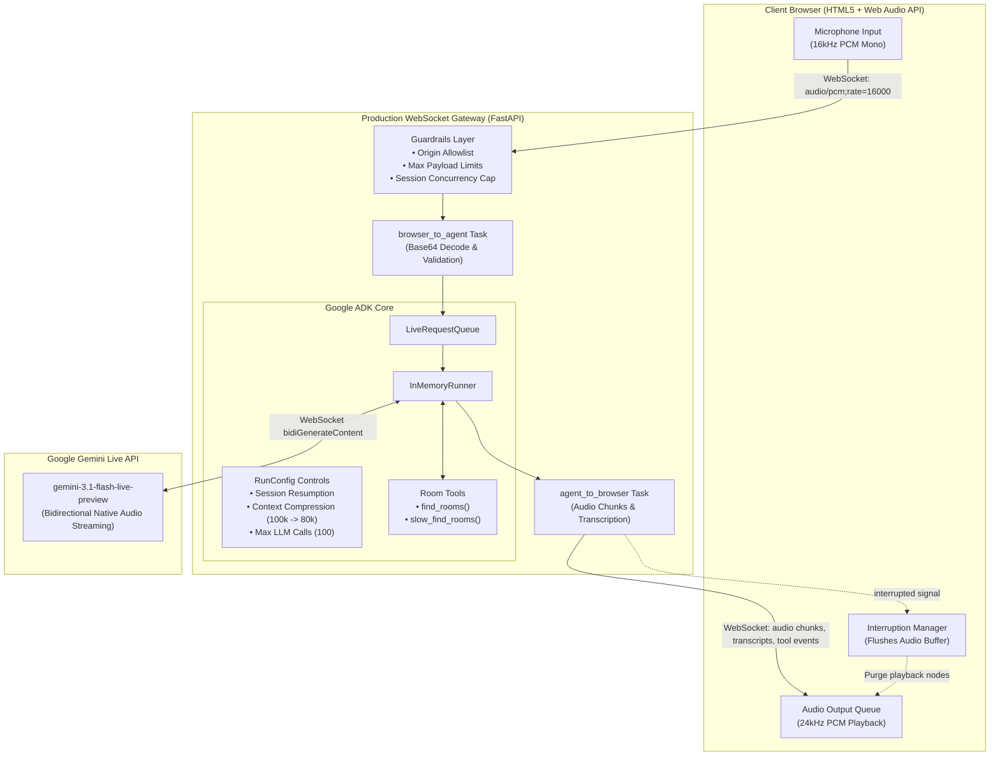

# 🎙️ Building Real-Time Voice Agents with Google ADK & Gemini Live API

<div align="center">

[](https://www.python.org/)
[](https://adk.dev/)
[](https://ai.google.dev/gemini-api/docs/live-api)
[](https://fastapi.tiangolo.com/)
[](tests/)
[](LICENSE)

**A practical, guided workshop taking you from a single prompt instruction to a production-grade, low-latency conversational voice agent with function calling, interruption (barge-in), live transcription, and failure resilience.**

[Workshop Slides (Google Slides)](https://docs.google.com/presentation/d/1rO9ilaF21ZTv5zWEboJ0Th_qkVyTbKBRWPNS2K3-EFw/edit?usp=sharing) • [Facilitator Guide](FACILITATOR.md) • [Checkpoints](#-checkpoint-walkthrough)

</div>

---

## 🌟 Overview & Highlights

Building real-time voice agents requires solving fundamentally different challenges than traditional text chatbots:
- **Streaming Bidirectionality:** Processing user audio and returning synthesized speech continuously over WebSockets.
- **Natural Turn-Taking & Interruption:** Cancelling agent audio generation the millisecond the user starts speaking (barge-in).
- **Latency & Failure Recovery:** Preventing dead silence during tool execution and handling errors politely without exposing raw Python tracebacks.
- **Production Guardrails:** Protecting WebSocket gateways against memory blowups, token leakage, quota starvation, and privacy breaches.

This repository demonstrates how to build and scale voice agents using **Google Agent Development Kit (ADK)** and the **Gemini Live API** (`gemini-3.1-flash-live-preview`).

---

## 🏗️ System Architecture



---

## 🗺️ Checkpoint Walkthrough

Every stage is organized in a standalone, self-contained folder under `checkpoints/`. If you ever get stuck, you can jump immediately to the next checkpoint!

| Checkpoint | Focus Area | Model | Key Technical Highlights |
|---|---|---|---|
| [`00_start`](checkpoints/00_start/) | **Prompt Starter** | `gemini-3.6-flash` | Barebones ADK Agent. Hands-on exercise to refine conversational instructions. |
| [`01_basic`](checkpoints/01_basic/) | **Instruction Boundaries** | `gemini-3.6-flash` | Strict constraints: ask exactly one clarifying question, cap replies to 3 sentences, never fake bookings. |
| [`02_tool`](checkpoints/02_tool/) | **Function Calling** | `gemini-3.6-flash` | Attaches the `find_rooms` tool to search room availability by hour and capacity. |
| [`03_voice`](checkpoints/03_voice/) | **Voice & Live API** | `gemini-3.1-flash-live-preview` | Switches to real-time voice streaming with native audio in the ADK Developer UI (`adk web`). |
| [`04_slow_failure`](checkpoints/04_slow_failure/) | **Latency & Graceful Failure** | `gemini-3.1-flash-live-preview` | Integrates `slow_find_rooms`. Conversational waiting cues ("Let me check...") and polite failure responses on 1:00 PM (`13:00`). |
| [`05_custom_streaming`](checkpoints/05_custom_streaming/) | **Custom Full-Stack App** | `gemini-3.1-flash-live-preview` | Standalone FastAPI backend + Web Audio UI. Deconstructs `LiveRequestQueue`, dual concurrent tasks, and browser barge-in. |
| [`06_production`](checkpoints/06_production/) | **Production Hardening** | `gemini-3.1-flash-live-preview` | Production-grade safeguards: origin checks, concurrency caps, token compression, safe logging, and session resumption. |

---

## 🚀 Quickstart Guide

### 1. Prerequisites

- **Python**: `3.11`, `3.12`, or `3.13`
- **Package Manager**: [`uv`](https://docs.astral.sh/uv/getting-started/installation/) (recommended) or standard `pip`
- **Browser**: Google Chrome or Chromium-based browser (for Web Audio API support)
- **Hardware**: Microphone & **headphones** (headphones prevent speaker-to-mic feedback loops)
- **API Key**: A Google AI Studio API key ([Generate here](https://aistudio.google.com/app/apikey))

---

### 2. Installation & Configuration

1. **Clone the repository:**
   ```bash
   git clone <REPO_URL>
   cd adk-voice-workshop
   ```

2. **Configure your environment:**
   ```bash
   cp .env.example .env
   ```
   Open `.env` and configure your API key:
   ```env
   GEMINI_API_KEY=your_actual_gemini_api_key_here
   TEXT_MODEL=gemini-3.6-flash
   LIVE_MODEL=gemini-3.1-flash-live-preview
   ```

3. **Install dependencies:**
   Using `uv` (recommended):
   ```bash
   uv sync
   ```
   *Alternatively, using standard virtualenv & pip:*
   ```bash
   python3 -m venv .venv
   source .venv/bin/activate
   pip install -e .
   ```

4. **Run the preflight health check:**
   ```bash
   uv run python scripts/preflight.py
   # Or: PYTHONPATH=src .venv/bin/python scripts/preflight.py
   ```
   **Expected output:**
   ```text
   ✓ Python 3.11–3.13
   ✓ Dependencies
   ✓ API key configuration
   ✓ AI Studio mode
   ✓ Text model
   ✓ Live model
   ✓ Workshop checkpoints
   READY
   ```

---

## 🎮 Running the Checkpoints

### 📝 Text Checkpoints (`00_start` – `02_tool`)
Checkpoints 00–02 use `gemini-3.6-flash`. Use the ADK web console's text box to submit prompts.

```bash
cd checkpoints/02_tool
uv run adk web
```
*Open the printed URL (default: `http://localhost:5000`), select `room_agent`, and type:*
> *"Do you have any rooms available after 4 PM for 6 people?"*

> [!NOTE]
> Do not click the microphone button in Checkpoints 00–02; text models do not support the Live API bidirectional streaming endpoint.

---

### 🎙️ Voice Checkpoints (`03_voice` – `04_slow_failure`)
Checkpoint 03 transitions to `gemini-3.1-flash-live-preview` for voice-first interactions.

```bash
cd checkpoints/03_voice
# On macOS, export the SSL cert path to avoid WebSocket handshake issues:
export SSL_CERT_FILE="$(uv run python -m certifi)"
uv run adk web
```

*Open the URL, select `room_agent`, enable your microphone, and speak naturally:*
- **Standard lookup:** *"Find a room after three."*
- **Spontaneous correction:** *"Find a room after three—actually, make it after four."*
- **Boundary check:** *"Book the Cedar room for me."* *(The agent will clarify it can search, but never books).*

#### ⏱️ Testing Latency & Failure (`04_slow_failure`)
```bash
cd checkpoints/04_slow_failure
export SSL_CERT_FILE="$(uv run python -m certifi)"
uv run adk web
```
- **Latency buffering:** *"Find a room after three."* *(The agent will verbally notify you that it is checking before waiting 5 seconds).*
- **Failure recovery:** *"Find a room after one p.m."* *(Hour 13 triggers an intentional error; the agent apologizes gracefully and offers to try another time).*

---

### 🌐 Custom Streaming Web Application (`05_custom_streaming`)
Run the custom standalone FastAPI application on port `8001`:

```bash
cd checkpoints/05_custom_streaming
uv run uvicorn server:app --reload --port 8001
# Or: PYTHONPATH=../../src ../../.venv/bin/uvicorn server:app --reload --port 8001
```

1. Navigate to [http://localhost:8001](http://localhost:8001) in Chrome.
2. Put on headphones and click **Connect microphone**.
3. Speak with the agent and observe real-time user/agent transcriptions, tool events, and instant barge-in audio cutoffs.

---

### 🛡️ Production-Hardened Application (`06_production`)
Run the hardened enterprise-pattern server on port `8002`:

```bash
cd checkpoints/06_production
uv run uvicorn server:app --reload --port 8002
# Or: PYTHONPATH=../../src ../../.venv/bin/uvicorn server:app --reload --port 8002
```
Navigate to [http://localhost:8002](http://localhost:8002) to inspect the hardened streaming pipeline.

---

## 🛡️ Production Hardening Matrix (`checkpoints/06_production`)

Checkpoint 06 demonstrates how to guard a streaming voice application against real-world operational challenges:

| Threat / Operational Challenge | Solution Implemented in Checkpoint 06 | Configuration / Code Hook |
|---|---|---|
| **Cross-Site WebSocket Hijacking** | Strict `Origin` header validation against an allowlist | `WS_ALLOWED_ORIGINS` (rejects with close code `1008`) |
| **Buffer Overflow / Oversized Payloads** | Frame & decoded PCM chunk size caps | `MAX_WS_MESSAGE_BYTES=32768`<br/>`MAX_AUDIO_CHUNK_BYTES=16384` |
| **API Quota Exhaustion & DoS** | Session concurrency limiter with atomic lock | `MAX_ACTIVE_SESSIONS=20` (rejects with close code `1013`) |
| **Runaway Dialogue Token Costs** | Automatic context compression via sliding window | `ContextWindowCompressionConfig`<br/>*(trigger: 100k tokens, target: 80k)* |
| **Network Reconnection Drops** | Session resumption handles for seamless reconnects | `session_resumption=SessionResumptionConfig()` |
| **Infinite LLM Loop Runaways** | Strict cap on model inferences per session | `max_llm_calls=100` |
| **Blocking Async Event Loops** | Bounded tool worker threadpool | `ToolThreadPoolConfig(max_workers=4)` |
| **User Privacy & Compliance** | Strict redaction of conversation transcripts from logs | Telemetry logs connection IDs & durations only |
| **Information Leakage** | Opaque error reference UUIDs sent to clients | Internal stack traces logged securely server-side |

---

## 🧪 Testing & Verification

The project includes an automated test suite verifying tool execution, safety compliance, and WebSocket message parsing.

```bash
# Run pytest across all test modules:
PYTHONPATH=src uv run pytest
# Or: PYTHONPATH=src .venv/bin/pytest
```

```text
tests/test_production_server.py ...                                      [ 37%]
tests/test_repo_safety.py .                                              [ 50%]
tests/test_room_tools.py ....                                            [100%]
========================= 8 passed in 1.37s =========================
```

- `test_room_tools.py`: Tests boundary conditions, filter matching, artificial delay, and mock failure triggers.
- `test_production_server.py`: Validates binary audio decoding, schema rejection, and `RunConfig` guardrails.
- `test_repo_safety.py`: Prevents accidental commits of Google API keys across all repository files.

---

## 📚 Technical References & Documentation

- [Google Agent Development Kit (ADK) Documentation](https://adk.dev/)
- [ADK Python Streaming Guide](https://adk.dev/live/get-started/streaming-python/)
- [Gemini Live API Developer Documentation](https://ai.google.dev/gemini-api/docs/live-api/get-started-sdk)
- [Gemini 3.1 Flash Live Model Specs](https://ai.google.dev/gemini-api/docs/models/gemini-3.1-flash-live-preview)
- [Workshop Slide Deck](https://docs.google.com/presentation/d/1rO9ilaF21ZTv5zWEboJ0Th_qkVyTbKBRWPNS2K3-EFw/edit?usp=sharing)

---

<div align="center">
Built with ❤️ for voice AI developers exploring Google ADK & Gemini Live.
</div>
